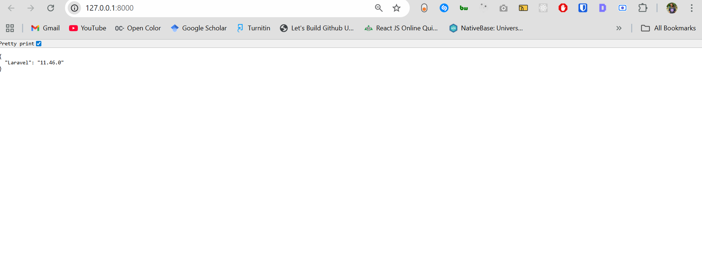

## How to install laravel and Next Js

First we need to start by creating a laravel project using the following command

```composer create-project --prefer-dist laravel/laravel backend "11.*" for a secific version

or

```composer create-project laravel/laravel backend - no specific laravel version

Where `backend= folder name of your own choosing`

Above command creates a laravel project in a folder called `backend` and given that after installing laravel with above method,it comes with its default templating `Engine` called `blade` and we currently only need `Laravel as a backend without the blade because it will be replaced with next js`.

This is what it would look like if we installed and used its laravel's blade template



So in order for us to like install `Next js` which in this case will act as our templating engine instead of `blade` we need to install `Laravel breeze`

`laravel breeze` which is a minimal, simple implementation of all of Laravel's authentication features, including login, registration, password reset, email verification, and password confirmation.

So we first need to require `Breeze` with our composer using the following command inside our project folder i.e `/backend` or`/foldername`

``` composer require laravel/breeze --dev

After Composer has installed the `Laravel Breeze package`, you should run the `breeze:install` Artisan command. 

This command publishes the authentication views, routes, controllers, and other resources to your application. 

`Laravel Breeze `publishes all of its code to your application so that you have full control and visibility over its features and implementation.

``` php artisan breeze:install

On running above command it ask us which `Breeze stack` would you like to install? We have `blade with Alpine`, we have `LiveWire` and we are going to use `API only`,because we only need laravel for the backend and `next js` for our front end .

So we don't need any web option, we don't want their front-end, we want to build front-end on our `Next.js application`. And for testing framework you can choose whatever you like `pest` in this case.

And one new database migration has been published. Would you like to run all pending database migrations? Yes, I'm going to run all the migrations and with that this should be finished.

After installing breeze we need to run our migrations.
 
```php artisan migrate

So now let's run the application again using `php artisan serve` and check out now what we are getting on our port 8000. When I refresh we are getting only the API response and we don't have anymore that web part of our project(`Laravel blade templating engine `).

```php artisan serve

Now we should be getting the following without the laravel defaulte templating engine blade


So now it is time to install new `Next.js` application we are going to our projects we are running the following command

 ```npx create next app@latest frontend


